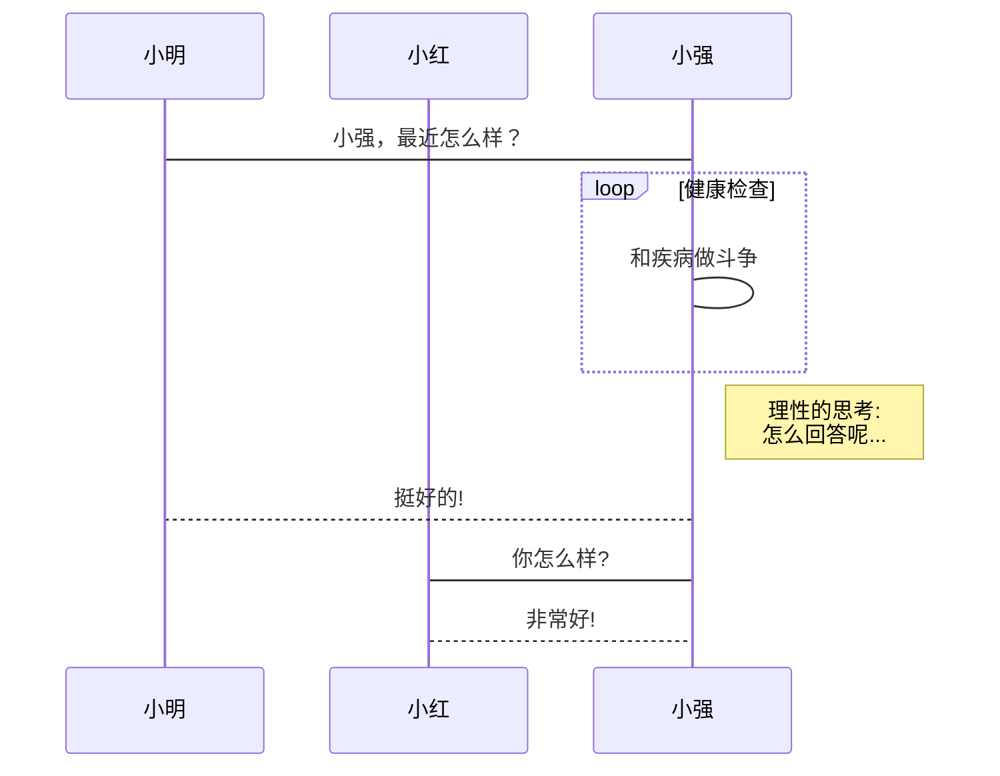

```mermaid
sequenceDiagram
    participant 小明
    participant 小红
    小明 -> 小强: 小强，最近怎么样？
    loop 健康检查
        小强 -> 小强: 和疾病做斗争
    end
    Note right of 小强: 理性的思考: <br/> 怎么回答呢...
    小强 --> 小明: 挺好的!
    小强 -> 小红: 你怎么样?
    小红 --> 小强: 非常好!
```