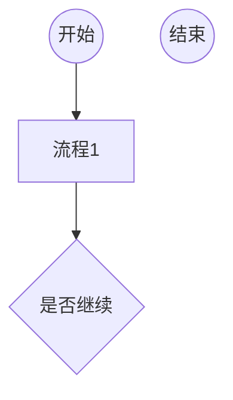

# 1. 图形
图形布局分四个方向，上下、下上、左右、右左，分别是TB(TD)/BT(DT)/RL/LR，字母必须为大写，具体代码如下：

B --否--> D[注册申请]
D --> E[审核通过]
E --> C[登录]
B --是--> C[登录]
C --> F{是否管理员}
F --否--> G[系统主页]
G --> H[相关操作]
H --> I{是否退出}
F --是--> J[处理日志]  
J --> I
I --否--> F
I --是--> K(结束) 