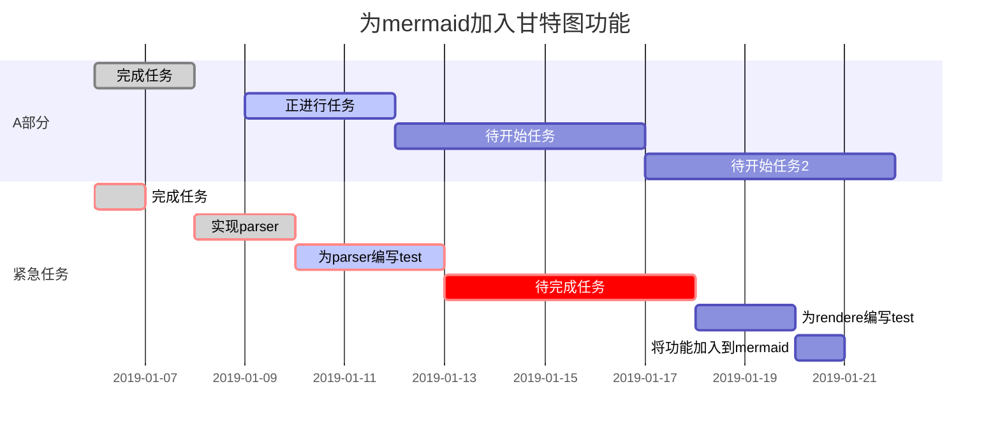

```mermaid
gantt
    dateFormat  YYYY-MM-DD
    title 为mermaid加入甘特图功能
    section A部分
    完成任务        :done, des1,2019-01-06,2019-01-08
    正进行任务      :active, des2,2019-01-09,3d
    待开始任务      :des3, after des2, 5d
    待开始任务2     :des4, after des3, 5d
    section 紧急任务
    完成任务        :crit,done,2019-01-06,24h
    实现parser     :crit,done,after des1, 2d
    为parser编写test :crit, active, 3d
    待完成任务      :crit,5d
    为rendere编写test: 2d
    将功能加入到mermaid: 1d
```
